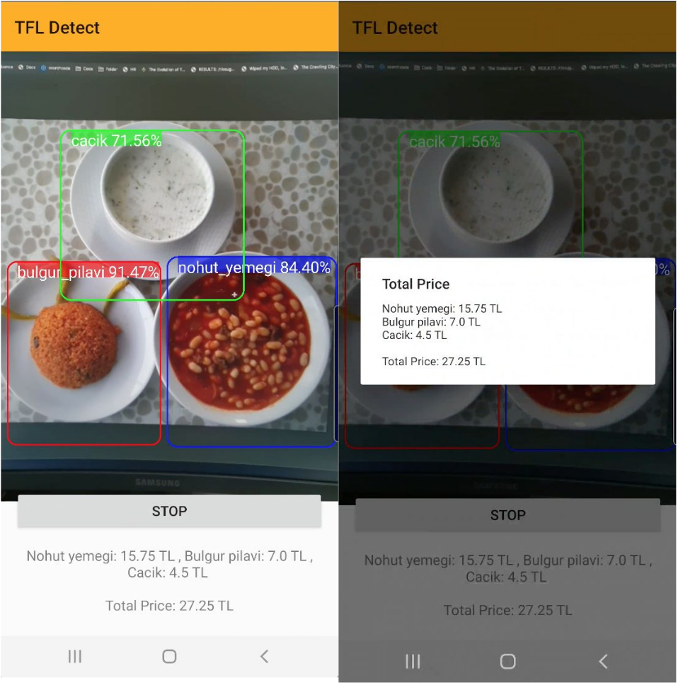
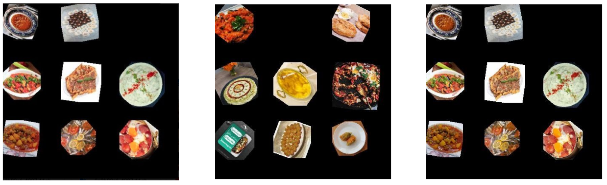
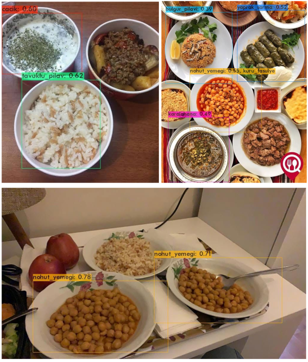

# Smart Cashier

## Mobile Application

This mobile application is developed for Android POS machines to authomize the entering foods to the system and getting the price.

## Dataset

The most prominent dataset used to train models on food images is Food-101 which
contains about 310,009 images of food classified in 101 classes. Since we want the model to be
successful in Turkey and Turkish cuisine, Turk-15, a public dataset that includes 15 most popular
Turkish foods, was used as the base dataset instead of Food-101. Thirty eight additional Turkish
food classes were added to the dataset by crawling online sources such as Google and Instagram.
Downloads from Google were filtered by search queries and Instagram were done using
hashtags. The data was cleaned and overall, the new dataset had 53 classes with various Turkish
foods ranging from bagels to Baklava and anchovies to artichokes.

Since images in the dataset consist of a single food which belongs to a single class, it is
hard for a model to train to detect objects where multiple objects of different classes are in a
single image(different foods in a tray). To solve this problem we created a canvas which is a 3x3
image grid. Images were randomly assigned to locations on this grid and for further data
augmentation their attributes such as contrast and brightness were manipulated to imitate
different lighting conditions.

## Model

We use the Alex AB’s YOLO v4 implementation.

The model performance was evaluated during training using a validation set separated
from the initial dataset since there are not enough images of trays with food to do a good
evaluation. After 50000 iterations, the smallest average loss was 5.12 and the highest mean
average precision (mAP) was around 81%. The graph below shows the progression of loss and
accuracy over iterations.

NOTE: The YOLO .tflife model is not available in this repo anyone interested can send me an email to get the model. (akul16@ku.edu.tr)
